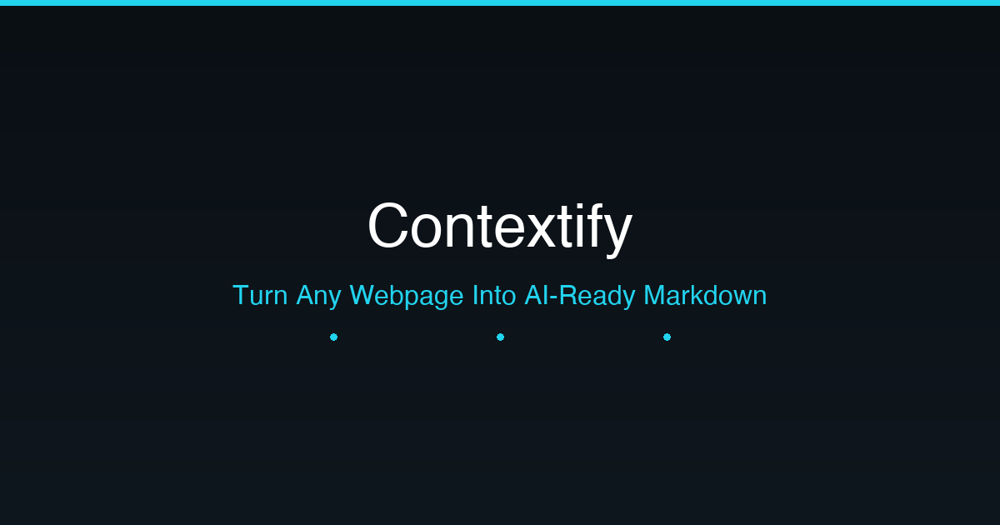

# Contextify

<p align="center">
  
</p>

<p align="center">
  <strong>Turn any webpage into AI-ready Markdown.</strong>
</p>

<p align="center">
  <a href="https://contextify-ai.vercel.app"><strong>contextify-ai.vercel.app</strong></a>
</p>

<p align="center">
  <a href="https://vercel.com/new/clone?repository-url=https://github.com/contextify/contextify">
    
  </a>
</p>

---

## About

Contextify converts any public webpage into clean, structured Markdown — optimized for AI workflows. Paste a URL, get back Markdown, Clean Markdown, AI Context format, JSON, or plain text in seconds. Built for developers, researchers, and AI power users who need to feed web content into LLMs like ChatGPT, Claude, Gemini, DeepSeek, Cursor, and Windsurf.

### Why Contextify?

- **AI-First**: Output formats tailored for ChatGPT, Claude, Gemini, DeepSeek, Cursor, Windsurf, and Cline.
- **Privacy-First**: No databases. No authentication. Content is processed server-side via a lightweight proxy with zero storage.
- **Production Quality**: Built with the same patterns used by Linear, Vercel, Stripe, and Notion.
- **Free Forever**: Deploy on Vercel Free tier and never pay a cent.

---

## Features

### 📝 Multiple Output Formats
- **Markdown** — Raw extracted markdown from the source page
- **Clean Markdown** — De-noised: removes navigation, footers, ads, redundant URLs, social share cruft
- **AI Context** — Structured format with Page Summary, Main Content, Important Facts, Links, and Metadata
- **JSON** — Structured `{ title, url, content, links, metadata }` with syntax highlighting
- **Plain Text** — Clean, readable plain text

### 🛠 Power Tools
- **Token Estimator** — Estimates token counts for GPT, Claude, and Gemini
- **Character & Word Counter** — Live stats as you view content
- **Reading Time** — Calculated reading time for extracted content
- **Copy to Clipboard** — One-click copy for any format
- **Download** — Download as `.md`, `.txt`, or `.json`

### 🌐 Internationalization
- **English & Spanish** — Full i18n support with EN/ES language toggle
- **Auto-detection** — Detects browser language on first visit

### 💾 Local-First
- **URL History** — Last 10 URLs saved locally (LocalStorage)
- **Favorites** — Bookmark pages for quick access
- **Dark Mode by Default** — Light mode toggle available

---

## Tech Stack

| Category | Technology |
|----------|-----------|
| **Framework** | [Next.js 16](https://nextjs.org/) (App Router) |
| **Runtime** | [React 19](https://react.dev/) |
| **Language** | [TypeScript](https://www.typescriptlang.org/) (strict) |
| **Styling** | [Tailwind CSS v4](https://tailwindcss.com/) |
| **UI Components** | [shadcn/ui](https://ui.shadcn.com/) + [Radix UI](https://www.radix-ui.com/) + [Base UI](https://base-ui.com/) |
| **Icons** | [Lucide React](https://lucide.dev/) |
| **Animation** | [Framer Motion](https://www.framer.com/motion/) + [tw-animate-css](https://github.com/jamiebuilds/tailwindcss-animate) |
| **State** | [Zustand](https://zustand.docs.pmnd.rs/) |
| **Forms** | [React Hook Form](https://react-hook-form.com/) + [Zod](https://zod.dev/) |
| **Markdown** | [react-markdown](https://remarkjs.github.io/react-markdown/) + [remark-gfm](https://github.com/remarkjs/remark-gfm) + [rehype-highlight](https://github.com/rehypejs/rehype-highlight) + [rehype-raw](https://github.com/rehypejs/rehype-raw) + [rehype-sanitize](https://github.com/rehypejs/rehype-sanitize) |
| **Theming** | [next-themes](https://github.com/pacocoursey/next-themes) |
| **Notifications** | [Sonner](https://sonner.emilkowal.ski/) |
| **Internationalization** | Custom i18n provider (EN/ES) |
| **Analytics** | [Vercel Analytics](https://vercel.com/analytics) + [Speed Insights](https://vercel.com/speed-insights) |
| **Content Extraction** | [Jina AI Reader](https://jina.ai/reader/) |
| **Deployment** | [Vercel](https://vercel.com/) |

---

## Getting Started

### Prerequisites

- [Node.js](https://nodejs.org/) 18+
- [npm](https://www.npmjs.com/) 9+

### Installation

```bash
# Clone the repository
git clone https://github.com/contextify/contextify.git
cd contextify

# Install dependencies
npm install

# Start development server
npm run dev
```

Open [http://localhost:3000](http://localhost:3000) in your browser.

### Build for Production

```bash
npm run build
npm start
```

---

## Architecture

```
src/
├── app/                    # Next.js App Router pages
│   ├── layout.tsx          # Root layout with SEO metadata, fonts, providers
│   ├── page.tsx            # Landing page (Hero + Features + How It Works + Use Cases + CTA)
│   ├── convert/
│   │   ├── page.tsx        # Convert page (wrapper with Suspense)
│   │   └── ConvertPageClient.tsx  # Main conversion tool client component
│   ├── api/convert/
│   │   └── route.ts        # POST endpoint proxying Jina AI Reader
│   ├── robots.ts           # robots.txt generation
│   └── sitemap.ts          # sitemap.xml generation
├── components/
│   ├── Header.tsx          # Navigation + Language Switcher + Theme Toggle
│   ├── Footer.tsx          # Footer with product and connect links
│   ├── UrlInput.tsx        # URL input with validation
│   ├── ResultTabs.tsx      # Tab navigation for output formats
│   ├── MarkdownViewer.tsx  # Rendered markdown display (react-markdown)
│   ├── CopyButton.tsx      # Copy-to-clipboard with fallback
│   ├── DownloadButton.tsx  # File download button
│   ├── TokenCounter.tsx    # Characters / words / tokens / reading time stats
│   ├── FeatureCard.tsx     # Animated feature card for landing page
│   ├── HistoryPanel.tsx    # Recent URL history
│   ├── FavoritesPanel.tsx  # Bookmarked pages
│   ├── LoadingState.tsx    # Loading skeleton
│   ├── ErrorState.tsx      # Error display with retry
│   ├── language-provider.tsx  # i18n context provider (EN/ES)
│   ├── layout/
│   │   └── theme-provider.tsx  # Dark/light theme provider
│   └── ui/                 # shadcn/ui primitives (button, card, tabs, dialog, etc.)
├── hooks/
│   └── useTheme.tsx        # Theme provider wrapping next-themes
├── services/
│   ├── jina.ts             # Jina AI content extraction + parsing
│   └── markdown.ts         # Markdown cleaning, format converters (JSON, AI Context, Plain Text)
├── store/
│   ├── useHistory.ts       # Zustand store for URL history
│   └── useFavorites.ts     # Zustand store for favorites
├── lib/
│   ├── utils.ts            # cn(), clipboard, download, token estimation, formatting
│   └── translations.ts     # i18n translation keys (EN + ES)
└── types/
    └── index.ts            # TypeScript type definitions (PageData, AppState, etc.)
```

---

## SEO & Metadata

Full Open Graph, Twitter Cards, robots.txt, and sitemap.xml configured for maximum discoverability:

- **OG Image**: Custom social preview image
- **Canonical URLs**: Proper canonical link tags
- **Robots**: Optimized directives for all crawlers
- **Sitemap**: Auto-generated sitemap.xml
- **JSON-LD**: (coming in v2 for rich results)

---

## Performance Targets

| Metric | Target |
|--------|--------|
| Lighthouse Performance | 95+ |
| Lighthouse Accessibility | 100 |
| Lighthouse SEO | 100 |
| Lighthouse Best Practices | 100 |
| First Contentful Paint | < 1.5s |
| Time to Interactive | < 2.5s |
| Core Web Vitals (LCP) | < 2.5s |

---

## Roadmap v2

- [ ] Batch URL Processing
- [ ] Multi-Page Crawl
- [ ] Website to Markdown (full sitemap processing)
- [ ] Documentation Export
- [ ] ZIP Export (multiple pages)
- [ ] Knowledge Base Generator
- [ ] RAG Context Generator
- [ ] AI Agent Context Pack
- [ ] JSON-LD Structured Data
- [ ] PWA Support
- [ ] Offline Mode

---

## Contributing

Contributions are welcome! Please open an issue or submit a pull request.

---

## License

MIT © [Contextify](https://contextify-ai.vercel.app)

---

<p align="center">
  Built with ❤️ using Next.js · Vercel · Jina AI
</p>
